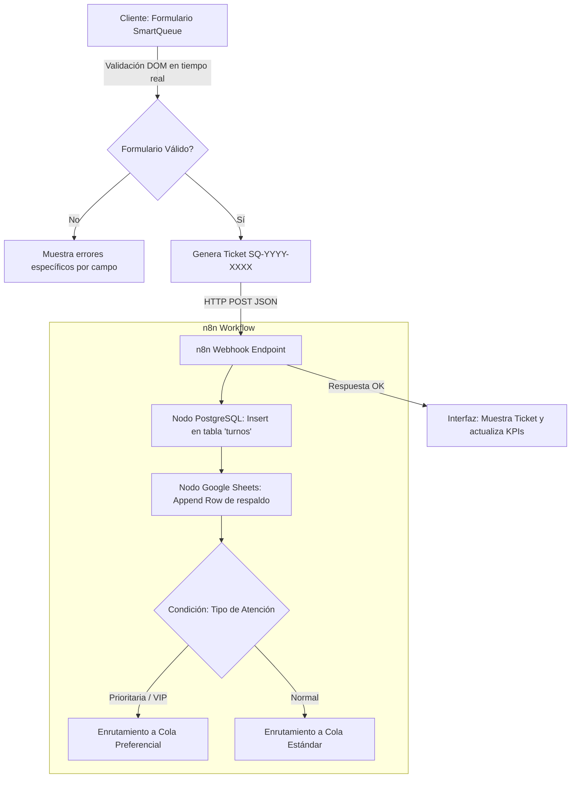

# 🎫 SmartQueue — Sistema de Gestión y Asignación de Turnos con n8n y PostgreSQL

[](https://developer.mozilla.org/es/docs/Web/JavaScript)
[](https://n8n.io/)
[](https://www.postgresql.org/)
[](https://sheets.google.com/)
[](LICENSE)
[](https://github.com/Zenda0610)

**SmartQueue** es una solución integral de agendamiento y emisión digital de turnos orientada a optimizar la atención al cliente en oficinas, centros médicos y entidades de servicio.

Combina una interfaz web interactiva con validación en tiempo real, emisión de comprobantes digitales (`SQ-YYYY-XXXX`) y una canalización automatizada mediante **webhooks de n8n** con doble persistencia: transaccional en **PostgreSQL** y respaldo tabular en **Google Sheets**.

---

## 🎯 Problema que Resuelve

1. **Colas físicas y tiempos de espera descontrolados:** Falta de pre-registro digital de usuarios.
2. **Validación deficiente:** Ingesta de correos malformados, teléfonos vacíos o reservas en fechas pasadas.
3. **Pérdida de trazabilidad:** Registro manual en papel o planillas aisladas sin inserción directa en una base de datos relacional.

**Solución de SmartQueue:**
- Formulario reactivo con control estricto de fechas (restringido a fechas presentes y futuras) y formato de correo electrónico.
- Generador de tickets únicos con resumen de servicio y fecha formateada para el usuario.
- Automatización sin servidor (*serverless*) conectando el frontend con PostgreSQL mediante n8n.
- **Modo Demostración / Simulado:** Permite evaluar el flujo completo de la interfaz de forma interactiva incluso si no se cuenta con una instancia de n8n activa.

---

## 🏗️ Arquitectura del Sistema



---

## 📁 Estructura del Proyecto

```text
Automatizaci-nn8n/
├── index.html                  # Landing page y formulario de solicitud de turnos
├── style.css                   # Sistema de diseño, temas y diseño responsivo
├── app.js                      # Lógica de validación, generación de turnos y envío HTTP
├── smartqueue-workflow.json    # Flujo exportado de n8n con nodos Postgres y Sheets
├── schema.sql                  # Esquema DDL para crear la tabla 'turnos' en PostgreSQL
├── package.json                # Metadatos del proyecto y script de prueba
├── .gitignore                  # Exclusión de configuraciones de editor y temporales
└── README.md                   # Documentación técnica completa
```

---

## ⚙️ Configuración y Despliegue

### 1. Base de Datos (PostgreSQL)
Ejecuta el script [schema.sql](schema.sql) en tu base de datos de PostgreSQL:

```bash
psql -U tu_usuario -d tu_base_datos -f schema.sql
```

Esto creará la tabla `turnos` con los índices necesarios para consultas por fecha y servicio.

### 2. Flujo de Trabajo en n8n
1. Abre tu instancia de [n8n](https://n8n.io/).
2. Importa el archivo `smartqueue-workflow.json` (**Workflow -> Import from File**).
3. Conecta tus credenciales en el nodo de **PostgreSQL** y en el nodo de **Google Sheets**.
4. Activa el webhook en n8n y copia la URL de producción o test.

### 3. Configurar la URL en el Frontend
Puedes enlazar tu webhook de dos formas:
- **Desde la consola del navegador:**
  ```javascript
  localStorage.setItem('smartqueue_webhook_url', 'https://tu-n8n.com/webhook/smartqueue');
  ```
- **Editando `app.js`:** Reemplazando el valor por defecto de `WEBHOOK_URL`.

> **Modo Demo Activo:** Si abres `index.html` sin configurar un webhook, la aplicación simulará el procesamiento y emitirá el ticket exitosamente con feedback visual de carga.

---

## 🧪 Verificación de Sintaxis

```bash
npm test
```

---

## 📄 Licencia

Este proyecto se distribuye bajo la Licencia MIT. Consulta el archivo `LICENSE` para más información.

---

**Autor:** David Leonardo Martínez ([@Zenda0610](https://github.com/Zenda0610))  
*Desarrollador de Software | Especializado en Desarrollo Web Full Stack y Automatización de Procesos*
